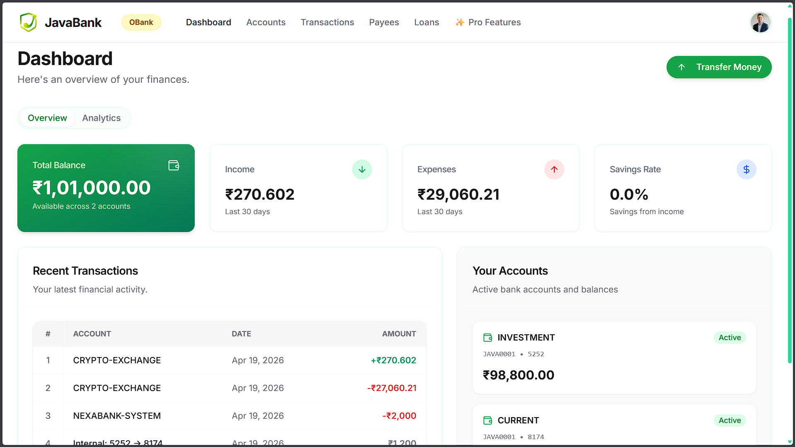

# JavaBank (Individual Docker Runbook)

JavaBank is the Spring Boot + Next.js banking application used to generate realistic tenant activity for FinInsights.

This README is focused on:

- Running JavaBank with Docker
- Required backend/frontend configuration
- Mandatory simulation workflow
- Visual overview with JavaBank assets

## JavaBank Identity

<p align="center">
  
</p>

<p align="center">
  
</p>

## 1. Mandatory First Action: Run Admin Simulation

After JavaBank starts, open:

- `http://localhost:3000/admin/simulate`

Run simulation in this order:

1. Tenant: `JBank (bank_a)`
2. User Count: `20`
3. Historical Days: `10`
4. Click `Run Simulation`
5. Change tenant to `OBank (bank_b)`
6. Keep User Count `20` and Historical Days `10`
7. Click `Run Simulation` again

This warm-up step prepares multi-tenant analytics data for demo and validation.

## 2. Docker Run (JavaBank Only)

From `JavaBank` folder:

```bash
docker compose up --build
```

Services:

- Frontend: `http://localhost:3000`
- Backend: `http://localhost:5001`

Stop:

```bash
docker compose down
```

## 3. Configuration

### 3.1 Backend Environment

JavaBank Docker compose defines backend environment directly in `JavaBank/docker-compose.yml`.

Important values used by default:

- `PORT=5001`
- `FRONTEND_URL=http://localhost:3000`
- `INGESTION_API_URL=http://host.docker.internal:8000/events`
- `ANALYTICS_API_URL=http://host.docker.internal:8001`

Tenant identities seeded by backend startup:

- `bank_a` -> `JBank`
- `bank_b` -> `OBank`

### 3.2 Frontend API Binding

JavaBank frontend container uses:

- `NEXT_PUBLIC_API_URL=http://localhost:5001/api`
- `NEXT_PUBLIC_INGESTION_URL=http://localhost:8000/events`

These are already wired in `JavaBank/docker-compose.yml`.

## 4. How JavaBank Works

1. User activity happens in frontend modules (accounts, loans, payee, crypto, payroll, wealth).
2. Spring Boot backend processes domain actions and persists records.
3. Admin simulation endpoint generates synthetic journeys with tenant context.
4. Events are forwarded to ingestion and become available to the analytics stack.

## 5. Quick Validation

1. Login to JavaBank frontend successfully.
2. Open Admin Simulation page and run both tenants one by one.
3. Confirm success output for each run in the simulation panel.
4. Verify tenant-specific updates appear in FinInsights dashboard.

## 6. Troubleshooting

1. Frontend cannot reach backend:
   verify backend is up at `http://localhost:5001`.
2. Simulation fails:
   check backend logs and confirm compose env values are correct.
3. No analytics updates:
   run the full root stack so ingestion and analytics services are active.
