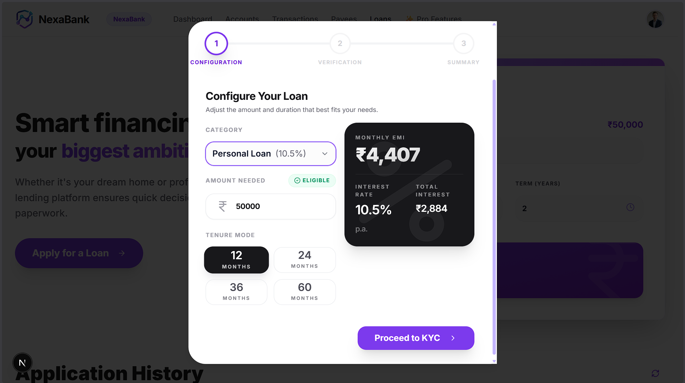
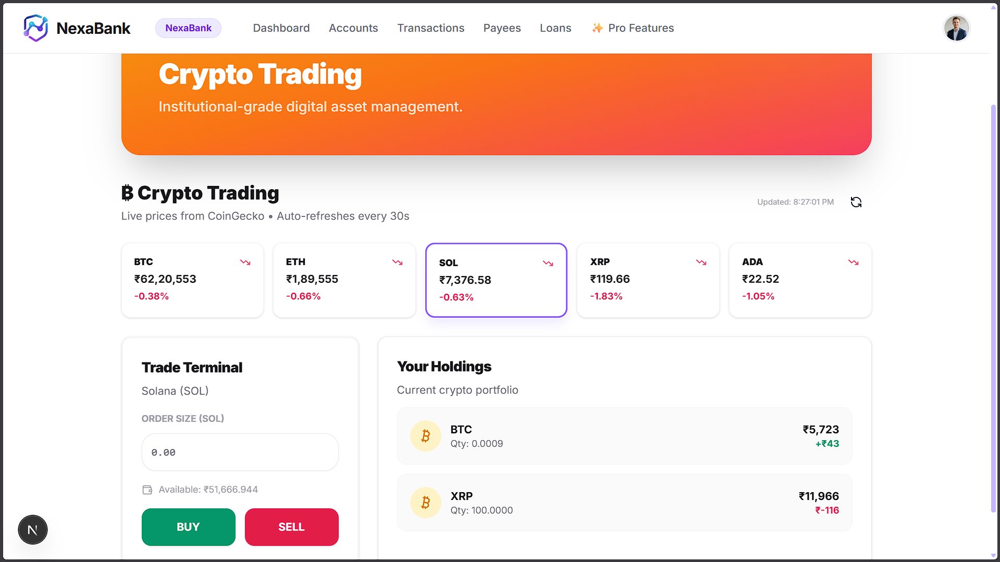
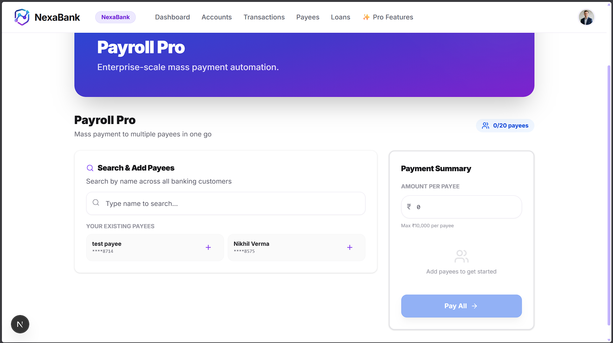
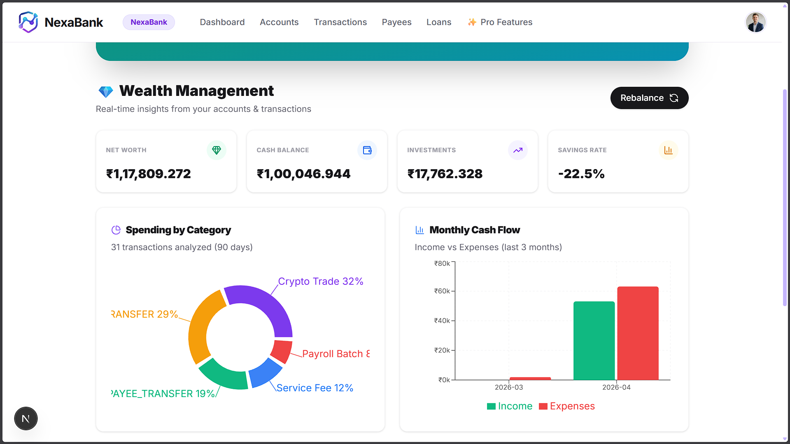

# NexaBank (Individual Docker Runbook)

NexaBank is the product-side banking application used to generate realistic tenant activity for FinInsights.

This README is focused on:

- Running NexaBank with Docker
- Required backend/frontend configuration
- Mandatory simulation workflow
- Visual explanation of major NexaBank modules

## 1. Mandatory First Action: Run Admin Simulation

After NexaBank starts, open:

- `http://localhost:3002/admin/simulate`

Run simulation in this exact order:

1. Tenant: `NexaBank (bank_a)`
2. User Count: `20`
3. Historical Days: `10`
4. Click `Run Simulation`
5. Change tenant to `SafeX Bank (bank_b)`
6. Keep User Count `20` and Historical Days `10`
7. Click `Run Simulation` again

This is the required warm-up step for multi-tenant analytics and demo readiness.

## 2. Docker Run (NexaBank Only)

From `NexaBank` folder:

```bash
docker compose up --build
```

Services:

- Frontend: `http://localhost:3002`
- Backend: `http://localhost:5000`

Stop:

```bash
docker compose down
```

## 3. Configuration

### 3.1 Backend Environment

Create or update `NexaBank/backend/.env`:

```env
PORT=5000
NODE_ENV="development"
JWT_SEC="REPLACE_WITH_A_LONG_RANDOM_SECRET"
DATABASE_URL="postgresql://<user>:<password>@<host>:6543/postgres?pgbouncer=true&sslmode=require"
DIRECT_URL="postgresql://<user>:<password>@<host>:5432/postgres?sslmode=require"
FRONTEND_URL="http://localhost:3002"

TENANT_A_ID=bank_a
TENANT_A_NAME=NexaBank
TENANT_A_IFSC=NEXA
TENANT_A_BRANCH=0001
TENANT_B_ID=bank_b
TENANT_B_NAME=SafeX Bank
TENANT_B_IFSC=SAFX
TENANT_B_BRANCH=0001

SYSTEM_EMAIL=system@nexabank.internal
SYSTEM_NAME=NexaBank System
SYSTEM_TENANT=bank_a
```

### 3.2 Frontend API Binding

NexaBank frontend container uses:

- `NEXT_PUBLIC_API_URL=http://localhost:5000/api`

This is already wired in `NexaBank/docker-compose.yml`.

## 4. How NexaBank Works

1. User activity occurs in frontend modules (accounts, loans, crypto, payroll, wealth).
2. Backend processes domain actions and persists operational records.
3. Simulation endpoint generates synthetic journeys with tenant context.
4. Events are available for downstream analytics processing in the full platform stack.

## 5. Visual Walkthrough (NexaBank Wireframes)

### 5.1 Home Experience

<p align="center">
  
</p>

### 5.2 Loans Overview

<p align="center">
  
</p>

### 5.3 Apply Loan Flow

<p align="center">
  
</p>

### 5.4 Crypto Trading

<p align="center">
  
</p>

### 5.5 Payroll Pro

<p align="center">
  
</p>

### 5.6 Wealth Management

<p align="center">
  
</p>

### 5.7 Admin Simulation Console

<p align="center">
  
</p>

## 6. Quick Validation

1. Login to NexaBank frontend successfully.
2. Open Admin Simulation page and run both tenants one by one.
3. Confirm success output for each run in simulation panel.
4. Verify tenant-specific activity appears in FinInsights dashboard.

## 7. Troubleshooting

1. Frontend cannot reach backend:
   verify backend is up at `http://localhost:5000`.
2. Simulation fails:
   confirm backend env and database credentials are valid.
3. No analytics updates:
   run the full root stack so ingestion and analytics services are active.
