<p align="center">
  
</p>

<h1 align="center">FinInsights</h1>
<p align="center"><b>Enterprise Multi-Tenant Feature Intelligence and Growth Analytics Platform</b></p>

<p align="center">
  
  
  
  
  
  
</p>

---

## Table of Contents

- [0. Critical First Step (Run Simulation After Setup)](#0-critical-first-step-run-simulation-first)
- [1. What This Project Is](#1-what-this-project-is)
- [2. How to Run (Docker-First)](#2-how-to-run-docker-first)
- [3. Environment Configuration](#3-environment-configuration)
- [4. Post-Startup Validation Checklist](#4-post-startup-validation-checklist)
- [5. First-Time Access and RBAC Setup](#5-first-time-access-and-rbac-setup)
- [6. Seed and Generate Data](#6-seed-and-generate-data)
- [7. Architecture and How It Works](#7-architecture-and-how-it-works)
- [8. Detailed Functional Modules](#8-detailed-functional-modules)
- [9. Visual Walkthrough (Wireframes)](#9-visual-walkthrough-wireframes)
- [10. Useful Commands](#10-useful-commands)
- [11. Troubleshooting](#11-troubleshooting)

---

## 0. Critical First Step (Run Simulation After Setup)

This is the most important startup action for demos and evaluations.

Immediately after services are up, open NexaBank and run simulation from:

- `http://localhost:3002/admin/simulate`

Run **two separate simulations**, one bank at a time:

1. Select tenant: `NexaBank (bank_a)`
2. Set `User Count = 20`
3. Set `Historical Days = 10`
4. Click `Run Simulation`
5. Repeat with tenant: `SafeX Bank (bank_b)` using the same values

Why this comes first:

- It guarantees both tenant datasets are populated before analytics review.
- All key FinInsights pages (Dashboard, Feature Analytics, Funnel, Predictive, AI Report) become immediately meaningful.

<p align="center">
  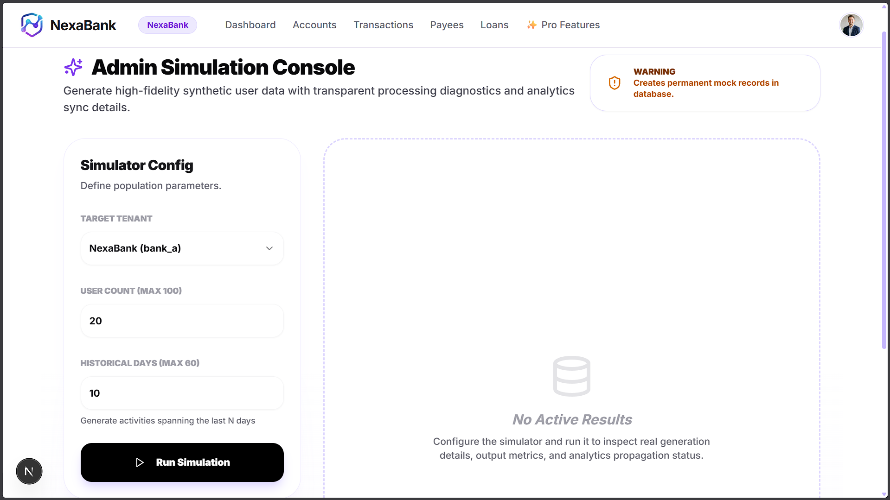
</p>

Primary references:

- Individual NexaBank Docker runbook: `NexaBank/readme.md`
- Individual Analytics Dashboard Docker runbook: `analytics-dashboard/README.md`

---

## 1. What This Project Is

FinInsights is a production-style analytics system designed for multi-tenant fintech products. It combines:

- NexaBank (banking product with real user journeys)
- Real-time telemetry ingestion and streaming
- OLAP analytics storage (ClickHouse)
- AI-assisted reporting
- Role-aware dashboard surfaces for operations and product teams

In the default setup, two tenant contexts are actively demonstrated:

- `nexabank`
- `safexbank`

This makes side-by-side tenant comparison practical and explainable for demos, reviews, and technical evaluation.

---

## 2. How to Run (Docker-First)

This section is intentionally detailed and is the recommended way to run the full stack.

### 2.1 Prerequisites

- Docker Desktop 4.x+
- At least 8 GB RAM available to Docker (10 GB recommended)
- At least 15 GB free disk space
- Ports available: `2181`, `3001`, `3002`, `5000`, `8000`, `8001`, `8123`, `9000`, `9092`, `11434`

### 2.2 Clone Repository

```bash
git clone https://github.com/abhishekkumawat-47/Nucleus-Analytic-tool-with-banking-website.git
cd Nucleus-Analytic-tool-with-banking-website
```

### 2.3 Prepare Config Files (Before Starting Containers)

You must configure these files first:

- `analytics-dashboard/.env.local`
- `NexaBank/backend/.env`
- `rbac.json`

Details are provided in [Section 3](#3-environment-configuration).

### 2.4 Start All Services

```bash
docker compose up --build
```

First boot can take 10 to 15 minutes because images are built and Ollama model warm-up is performed.

### 2.5 Service Access URLs

| Surface | URL | Purpose |
|---|---|---|
| NexaBank Frontend | http://localhost:3002 | End-user banking journeys |
| NexaBank Backend | http://localhost:5000 | Banking APIs |
| Ingestion API Docs | http://localhost:8000/docs | Event ingestion OpenAPI |
| Analytics API Docs | http://localhost:8001/docs | Analytics OpenAPI |
| Analytics Dashboard | http://localhost:3001 | FinInsights dashboard |
| ClickHouse HTTP | http://localhost:8123 | OLAP interface |
| Ollama API | http://localhost:11434 | Local LLM endpoint |

### 2.6 Individual Docker Runbooks

If you want module-specific Docker instructions, use:

- `NexaBank/readme.md` (NexaBank frontend + backend, simulation-first flow)
- `analytics-dashboard/README.md` (FinInsights dashboard, module usage, and API wiring)

---

## 3. Environment Configuration

This section explains exactly what to configure and why.

### 3.1 Analytics Dashboard Env (`analytics-dashboard/.env.local`)

Create or update:

```env
GOOGLE_CLIENT_ID="YOUR_GOOGLE_CLIENT_ID"
GOOGLE_CLIENT_SECRET="YOUR_GOOGLE_CLIENT_SECRET"
NEXTAUTH_URL="http://localhost:3001"
NEXTAUTH_SECRET="REPLACE_WITH_A_LONG_RANDOM_SECRET"
NEXT_PUBLIC_API_URL="/api"
NEXT_PUBLIC_ANALYTICS_WS_URL="ws://localhost:8001"
NEXT_PUBLIC_NEXABANK_URL="http://localhost:3002"
```

Notes:

- `NEXT_PUBLIC_API_URL=/api` uses dashboard rewrites to reach backend APIs.
- `NEXTAUTH_SECRET` must be strong and private.
- Never commit real OAuth credentials to public repositories.

### 3.2 NexaBank Backend Env (`NexaBank/backend/.env`)

Create or update:

```env
JWT_SEC="REPLACE_WITH_A_LONG_RANDOM_SECRET"
NODE_ENV="development"
DATABASE_URL="postgresql://<user>:<password>@<host>:6543/postgres?pgbouncer=true&sslmode=require"
DIRECT_URL="postgresql://<user>:<password>@<host>:5432/postgres?sslmode=require"
PORT=5000
FRONTEND_URL="http://localhost:3002"

TENANT_A_ID=bank_a
TENANT_A_NAME=NexaBank
TENANT_A_IFSC=NEXA
TENANT_A_BRANCH=0001
TENANT_B_ID=bank_b
TENANT_B_NAME=SafeX Bank
TENANT_B_IFSC=SAFX
TENANT_B_BRANCH=0001

SYSTEM_EMAIL=system@nexabank.internal
SYSTEM_NAME=NexaBank System
SYSTEM_TENANT=bank_a
```

Notes:

- `DATABASE_URL` is for pooled app usage.
- `DIRECT_URL` is used by Prisma workflows needing direct DB path.
- Tenant IDs map to analytics aliases (`bank_a` -> `nexabank`, `bank_b` -> `safexbank`).

### 3.3 RBAC Configuration (`rbac.json`)

Example:

```json
{
  "super_admins": [
    "judge@example.com"
  ],
  "app_admins": {
    "nexabank": [
      "nexa_admin@example.com"
    ],
    "safexbank": [
      "safe_admin@example.com"
    ]
  }
}
```

Notes:

- `super_admins`: global platform-level access.
- `app_admins`: tenant-scoped access.
- Dashboard mounts this file directly in Docker for policy reads.

### 3.4 Core Runtime Variables from Docker Compose

`docker-compose.yml` already configures key runtime wiring, including:

- `KAFKA_BROKER_URL=broker:29092`
- `CLICKHOUSE_HOST=clickhouse`
- `OLLAMA_URL=http://ollama:11434`
- `ANALYTICS_API_HOST=analytics-api`
- `INGESTION_API_HOST=ingestion-api`

In most cases you do not need to change these for local Docker execution.

---

## 4. Post-Startup Validation Checklist

After `docker compose up --build`, verify health quickly.

### 4.1 API Health

```bash
curl http://localhost:8000/health
curl http://localhost:8001/health
```

### 4.2 Swagger Availability

- http://localhost:8000/docs
- http://localhost:8001/docs

### 4.3 UI Availability

- http://localhost:3002 (NexaBank)
- http://localhost:3001 (FinInsights Dashboard)

### 4.4 Kafka Topic Initialization

`init-kafka` service should auto-create `feature-events` topic. If compose logs show topic creation success, streaming path is ready.

---

## 5. First-Time Access and RBAC Setup

### 5.1 Create a NexaBank User

1. Open http://localhost:3002
2. Register a user through 3-step flow
3. Login once to generate account-level baseline data

### 5.2 Promote User to Admin in NexaBank (To acccess "Analytics Dashboard" (FinInsights) as a App Admin)

```bash
pip install psycopg2-binary tabulate
python scripts/nexbank_user_lookup.py "judge@example.com"
```

### 5.3 Enable Dashboard Access

Add that same email into `rbac.json` under:

- `super_admins` for global access, or
- `app_admins.nexabank` and/or `app_admins.safexbank` for tenant-scoped access

Then log into http://localhost:3001 using that email.

---

## 6. Seed and Generate Data

If dashboard is sparse, generate telemetry.

### 6.1 Organic Data

Use NexaBank UI normally:

- Dashboard browsing
- Accounts and transactions
- Payees and transfers
- Loans and KYC paths
- Pro-feature interactions

### 6.2 Bulk Simulation Data

```bash
curl -X POST "http://localhost:5000/api/events/simulate?days=7"
```

This populates realistic event traffic across modules and tenants to exercise analytics views quickly.

---

## 7. Architecture and How It Works

Architecture is explained after run instructions by design, so setup and understanding are separated cleanly.

### 7.0 Architecture Diagram

The following diagram from `wireframes` shows the full runtime pipeline and how each layer interacts.

<p align="center">
  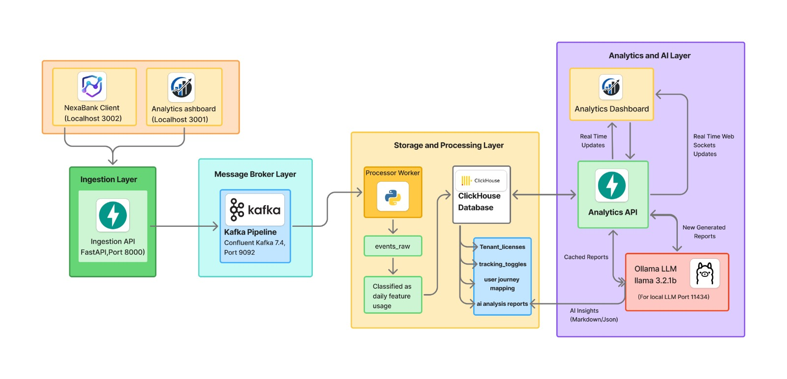
</p>

In plain language, read it left to right:

- Client layer: NexaBank and the Analytics Dashboard are the two user-facing applications.
- Ingestion layer: telemetry is accepted by the Ingestion API with minimal overhead.
- Broker layer: Kafka buffers and decouples incoming events from downstream processing.
- Storage and processing layer: the worker consumes events and writes them to ClickHouse tables (`events_raw`, feature usage aggregates, licenses, toggles, journey and AI report data).
- Analytics and AI layer: Analytics API serves dashboard queries and WebSocket updates; Ollama generates narrative AI insights from analytical summaries.

### 7.1 High-Level Architecture

```text
NexaBank Frontend (:3002)
        |
        | user actions + tracked events
        v
NexaBank Backend (:5000) -----> Ingestion API (:8000)
                                   |
                                   v
                           Kafka Broker (:9092)
                                   |
                                   v
                        Processor Worker (batch consumer)
                                   |
                                   v
                          ClickHouse (:8123/:9000)
                                   |
                    +--------------+--------------+
                    |                             |
                    v                             v
            Analytics API (:8001)         Ollama (:11434)
                    |
                    v
          FinInsights Dashboard (:3001)
```

### 7.2 End-to-End Event Lifecycle

1. User performs action in NexaBank.
2. Event is emitted with tenant context and metadata.
3. Ingestion API validates and pushes event into Kafka.
4. Processor worker consumes in micro-batches and writes to ClickHouse.
5. ClickHouse persists both raw events and analytical state tables used by FinInsights modules.
6. Analytics API computes KPIs, trends, funnels, retention, taxonomy views, governance state, and license intelligence.
7. Dashboard fetches tenant-scoped results via REST APIs and receives real-time updates over WebSocket.
8. AI report endpoints call Ollama and return executive-ready summaries while retaining local data control.

### 7.3 Why This Design Works

- Decoupled ingestion prevents banking UX slowdown.
- Kafka absorbs burst traffic safely.
- ClickHouse serves low-latency analytical reads.
- Stateless APIs simplify scaling.
- Tenant keying ensures logical data isolation.
- Local AI execution keeps sensitive analytics data inside your controlled environment.

---

## 8. Detailed Functional Modules

### 8.1 Feature Taxonomy and Normalization

FinInsights relies on canonical event naming patterns, for example:

- `login.auth.success`
- `dashboard.page.view`
- `loan.kyc_completed.success`
- `transaction.pay_now.success`

Normalization avoids duplicate aliases and keeps charts/governance consistent.

### 8.2 Feature Toggles and Governance

Governance controls feature-level telemetry behavior.

- Toggle tracking on/off by feature key
- Maintain actor-aware audit trail
- Keep behavior globally coherent across related tenant scopes where configured

### 8.3 License Usage Intelligence

License analytics correlates entitlement vs usage.

- Detect underused paid features
- Detect used-but-unlicensed features
- Support packaging, renewal, and upsell decisions

### 8.4 User Journey Mapping

Journey mapping reconstructs user event sequences.

- Identify drop-off steps
- Investigate path-level friction
- Complement aggregate metrics with behavioral traces

### 8.5 Funnel and Predictive Insights

- Funnel module highlights stage conversion loss.
- Predictive module estimates adoption momentum and risk.
- AI report summarizes complex metrics into executive-readable insights.

### 8.6 Multi-Tenant Comparison

Two live tenant contexts simplify comparative analysis:

- `nexabank`
- `safexbank`

Tenant comparison keeps time range and metric semantics consistent, enabling fair side-by-side performance interpretation.

---

## 9. Visual Walkthrough (Wireframes)

The following visuals are sourced from the `wireframes` folder and map directly to key modules.

### 9.1 Dashboard Overview

Main KPI board for events, active features, latency, error trends, and real-time user context.

<p align="center">
  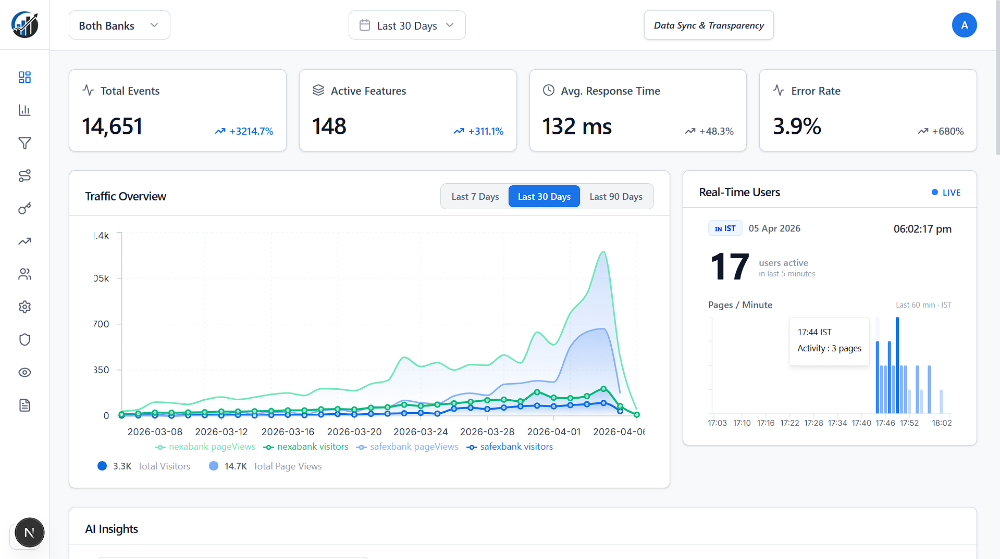
</p>

### 9.2 Feature Analytics

Trend lines and top-feature ranking across both tenant contexts with comparative behavior overlays.

<p align="center">
  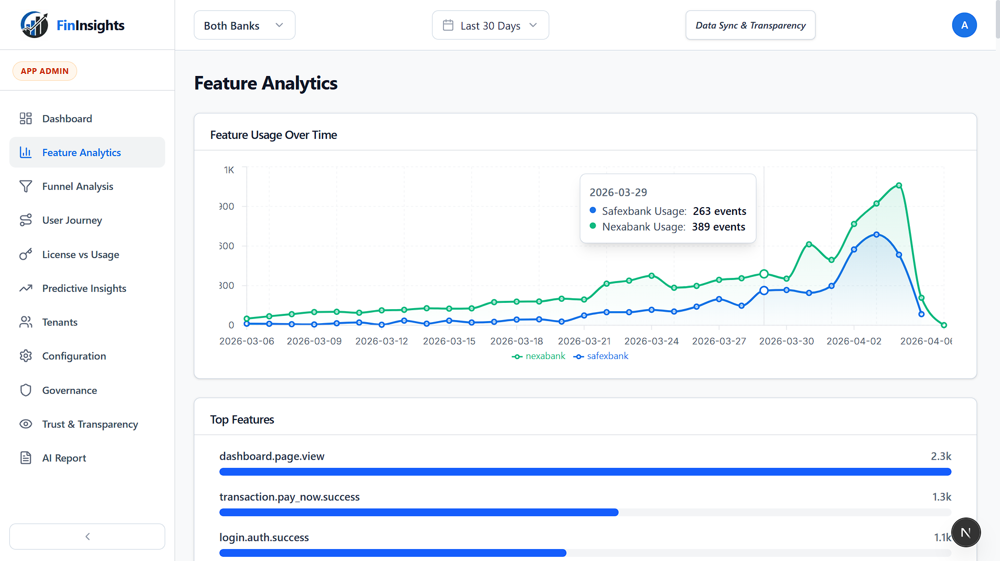
</p>

### 9.3 Funnel Analysis

Progression map and leakage matrix to identify conversion losses by stage and severity.

<p align="center">
  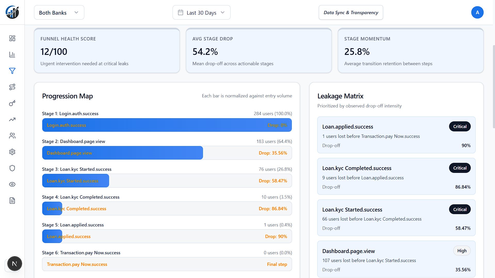
</p>

### 9.4 License Usage

Premium feature utilization surface for entitlement and adoption intelligence.

<p align="center">
  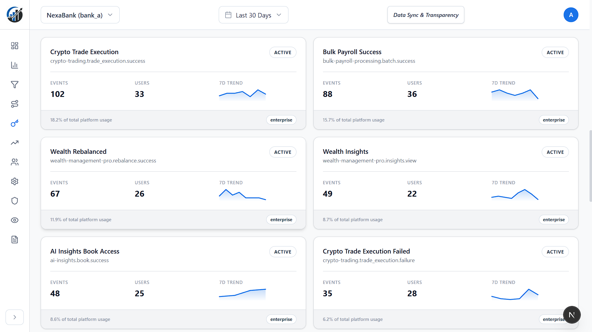
</p>

### 9.5 Predictive Insights

Opportunity radar and model pulse for forward-looking adoption interpretation.

<p align="center">
  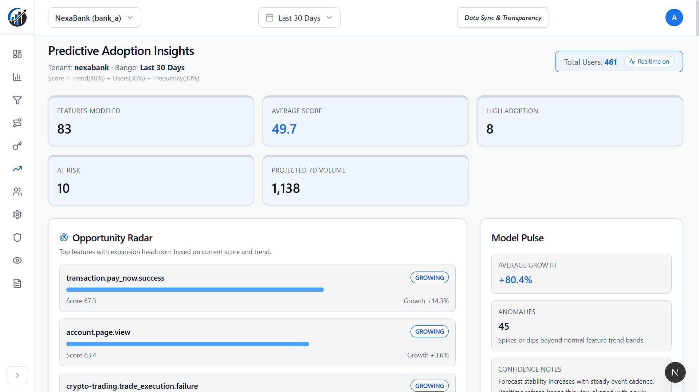
</p>

### 9.6 Tenant Comparison

Cross-tenant trend comparison for `nexabank` and `safexbank` within unified metric structure.

<p align="center">
  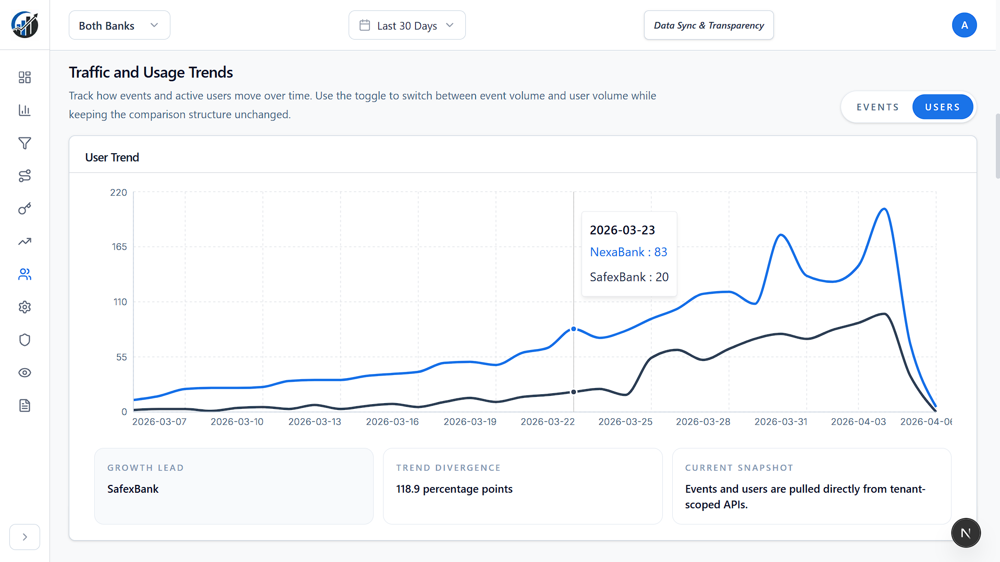
</p>

### 9.7 Trust and Transparency

Governance-focused data visibility matrix and on-prem/cloud exposure model.

<p align="center">
  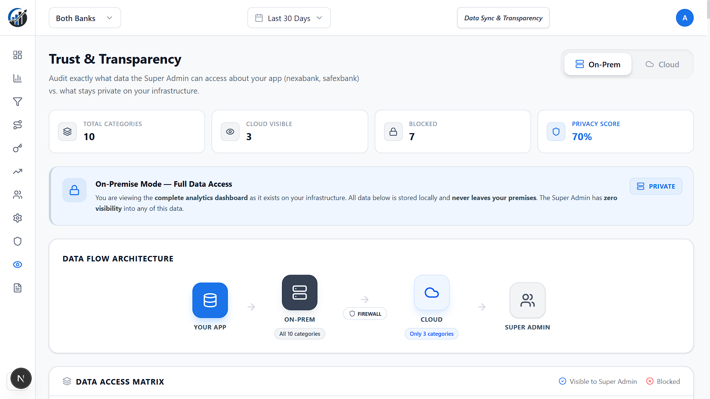
</p>

### 9.8 AI Report

Executive summary panel combining key takeaways, action plans, and analytics snapshots.

<p align="center">
  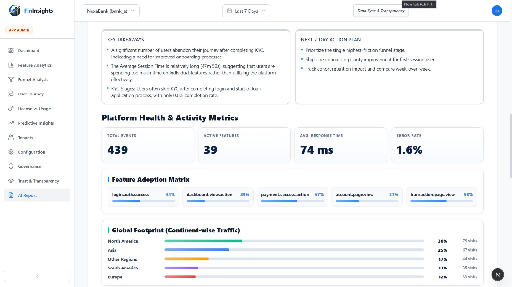
</p>

### 9.9 NexaBank Home

<p align="center">
  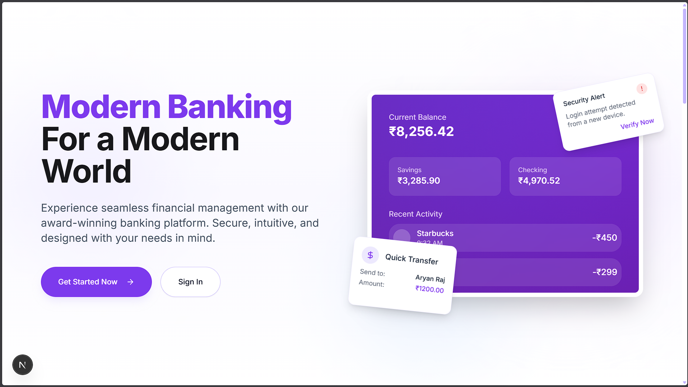
</p>

### 9.10 NexaBank Loans

<p align="center">
  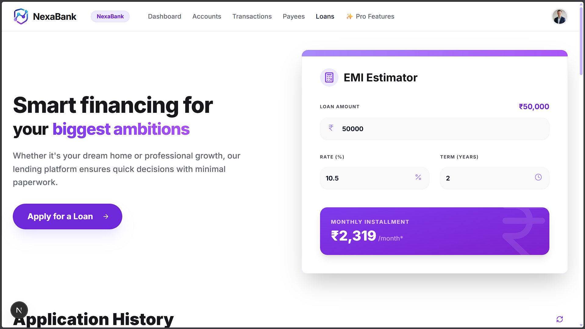
</p>

### 9.11 NexaBank Admin Simulation

<p align="center">
  
</p>

---

## 10. Useful Commands

### 10.1 Build and Start

```bash
docker compose up --build
```

### 10.2 Detached Mode

```bash
docker compose up -d
```

### 10.3 Stop Stack

```bash
docker compose down
```

### 10.4 Stop and Remove Volumes (Full Reset)

```bash
docker compose down -v
```

### 10.5 Tail Logs

```bash
docker compose logs -f analytics-api
docker compose logs -f ingestion-api
docker compose logs -f processor-worker
docker compose logs -f analytics-dashboard
docker compose logs -f nexabank-backend
```

---

## 11. Troubleshooting

### 11.1 Dashboard Login Issues

- Verify `GOOGLE_CLIENT_ID` and `GOOGLE_CLIENT_SECRET`.
- Verify `NEXTAUTH_URL=http://localhost:3001`.
- Verify your email exists in `rbac.json`.

### 11.2 Empty Charts

- Trigger simulation endpoint.
- Check ingestion and processor logs.
- Verify Kafka topic initialization completed.

### 11.3 API Reachability Errors

- Confirm services are healthy and ports are free.
- Check `ANALYTICS_API_HOST` and `INGESTION_API_HOST` in compose env.

### 11.4 Ollama/AI Delay

- First run model pull can take several minutes.
- Wait for init-ollama logs to complete warm-up.

### 11.5 DB/Prisma Errors in NexaBank Backend

- Validate `DATABASE_URL` and `DIRECT_URL`.
- Confirm remote database ACL/credentials.

---

## Maintainers

- Abhishek Kumawat
- Omesh Mehta
